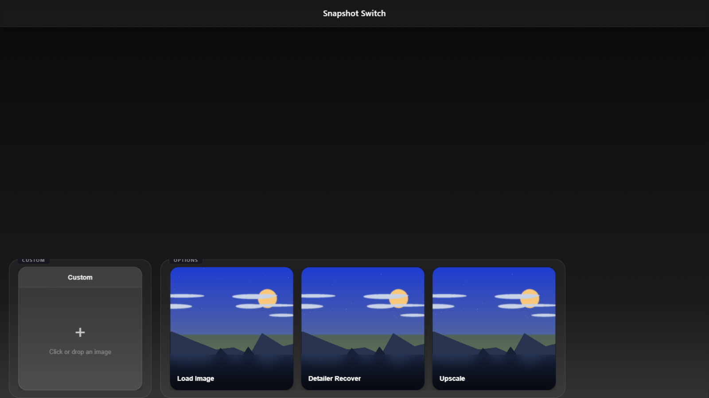
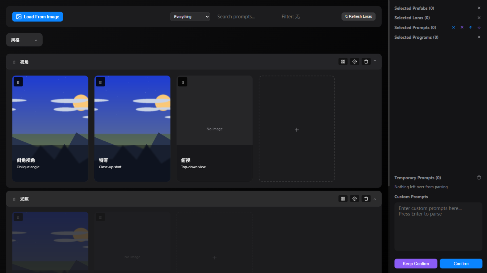
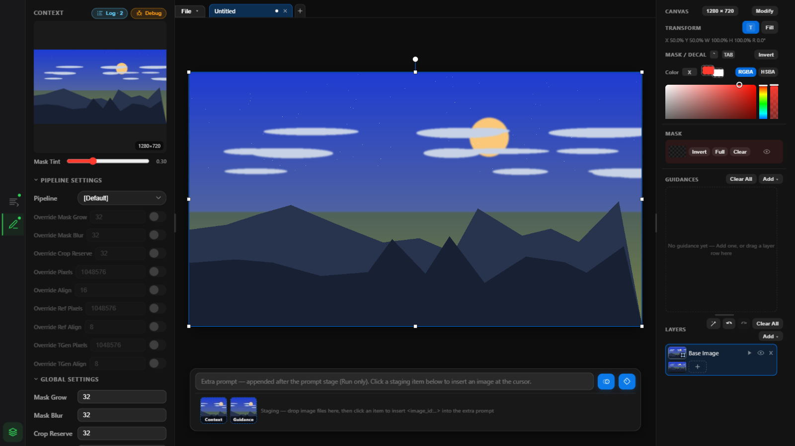
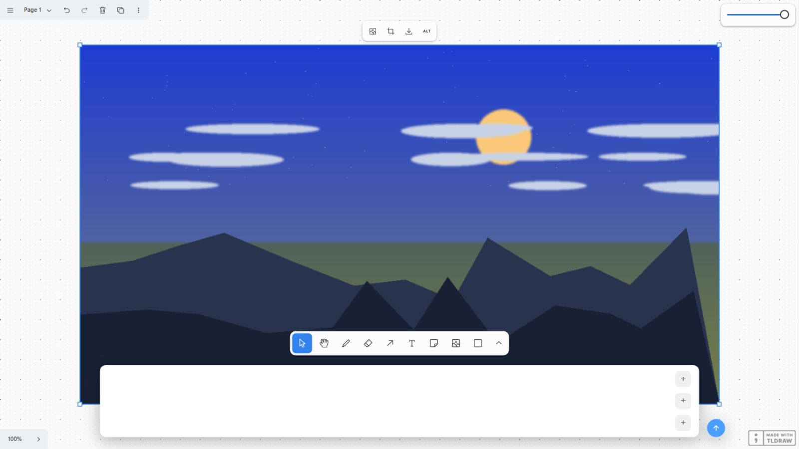
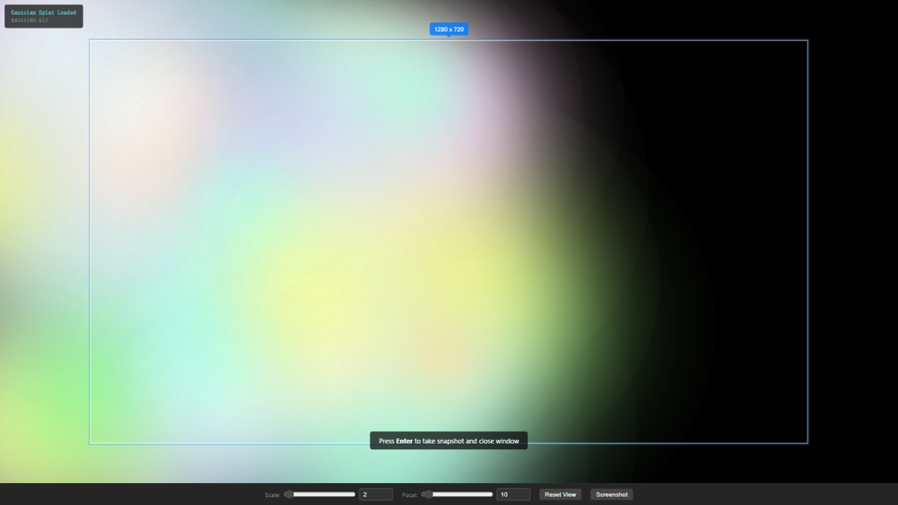
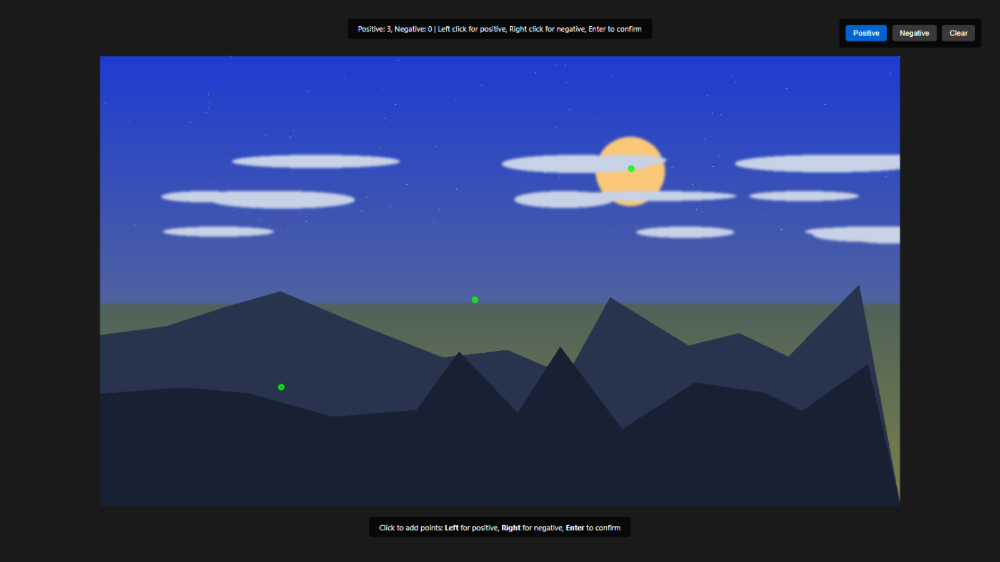
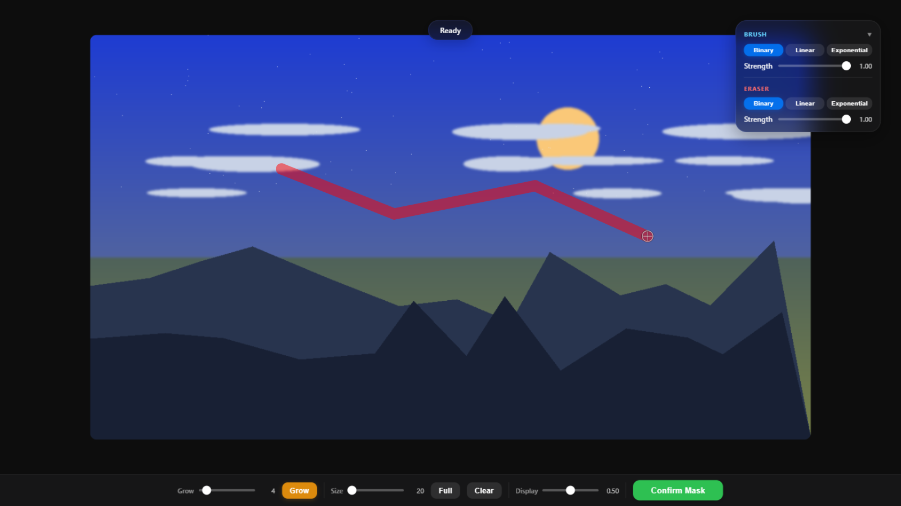
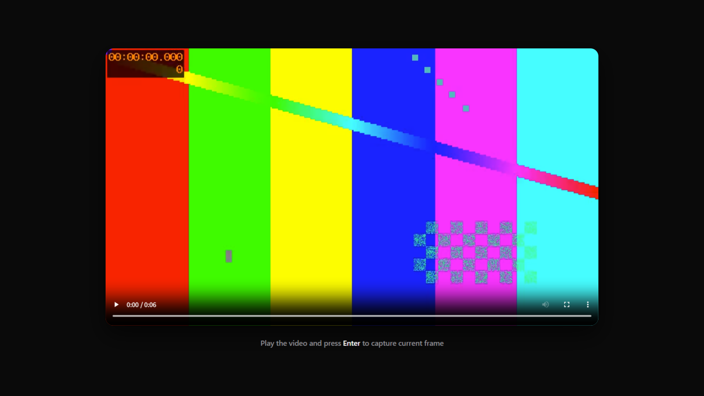
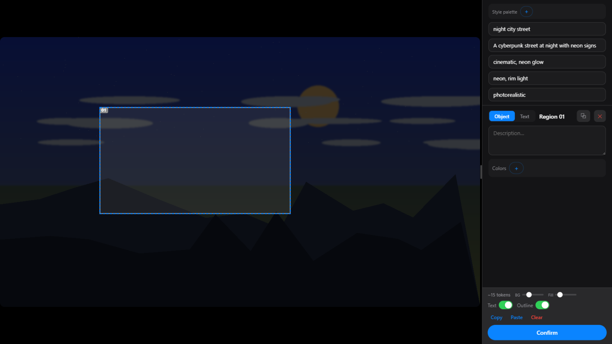

# 交互式 Web UI 节点

[← 返回主 README](../README.md)

这些节点会启动本地 HTTP 服务器并打开浏览器，允许用户通过可视化界面进行交互操作。

---

### SnapshotSwitchNode

动态输入选择器。连接多个上游输入后，打开浏览器页面预览所有输入内容，选择其中一个作为输出。支持 lazy 模式（不加载未选中输入）和历史快照缓存。

| 输入 | 类型 | 必填 | 说明 |
|------|------|------|------|
| lazy_switch | BOOLEAN | 是 | 默认 True，启用懒加载模式（仅加载被选中的输入） |
| global_cache | BOOLEAN | 是 | 默认 False，启用全局缓存 |
| connection_info | STRING | 是 | 连接信息 JSON，自动管理 |
| input1+ | * | 否 | 动态扩展输入，可连接任意类型，自动添加更多输入槽 |

**输出:** `output` (*)

---

### SnapshotPromptNode

提示词选择器。在浏览器中按分类浏览和选择 prompt 词条，支持 LoRA 选择、自定义 prompt 输入和预制词包（prefab）。输出合并后的 prompt 字符串、LoRA 列表和触发词。

| 输入 | 类型 | 必填 | 说明 |
|------|------|------|------|
| prompt_cache | BOOLEAN | 是 | 是否缓存 prompt 选择状态 |
| prompt | STRING | 是 | prompt 文本（多行） |
| prompt_parsing | STRING | 是 | prompt 解析规则 |
| lora_cache | BOOLEAN | 是 | 是否缓存 LoRA 选择状态 |
| lora_path_mode | BOOLEAN | 是 | LoRA 路径模式（True=直接路径，False=名称模式） |
| lora_regex | STRING | 是 | LoRA 正则过滤表达式 |
| lora | STRING | 是 | LoRA 选择数据（多行 JSON） |
| prefab_cache | BOOLEAN | 是 | 是否缓存预制词包状态 |
| prefab | STRING | 是 | 预制词包数据（多行 JSON） |
| program_cache | BOOLEAN | 是 | 是否缓存 Program 状态 |
| program | STRING | 是 | Program 代码数据（多行 JSON） |
| enable_region | BOOLEAN | 否 | 启用 bbox 区域编辑器 + caption JSON 输出 |
| image | IMAGE | 否 | 用于 bbox 区域编辑的可选图片 |
| width | INT | 否 | 画布宽度（默认 1024） |
| height | INT | 否 | 画布高度（默认 1024） |
| bg_brightness | INT | 否 | 背景亮度 0-100（默认 25） |
| region | STRING | 否 | 上次运行的缓存区域数据 |
| region_format | STRING | 否 | 带占位符的 JSON 模板 |
| tagger | * | 否 | Florence2 tagger 模型，用于 Tag From Image 按钮 |
| asset | STRING | 否 | Assets 快照 JSON 或名称，用于 Tag From Assets 按钮 |

**输出:** `prompt` (STRING), `active_loras` (STRING), `lora_trigger_words` (STRING), `merged_prompt` (STRING), `region_prompt` (STRING), `region_active_loras` (STRING), `preview` (IMAGE), `bboxes` (BBOX), `width` (INT), `height` (INT), `cache` (DICT)

---

### SnapshotDetailerSamplerNode

交互式细节修复采样器。整合 mask 绘制 → 提示词选择 → AI 重绘 → 对比切换的完整循环流程。用户可多次迭代精修图片细节。

| 输入 | 类型 | 必填 | 说明 |
|------|------|------|------|
| pipeline | PIPELINE_DATA | 是 | 管线数据 |
| seed | INT | 是 | 随机种子 |
| lora_regex | STRING | 是 | LoRA 正则过滤表达式 |
| context_regex | STRING | 是 | 上下文匹配正则（默认 ".+"） |
| add_noise | COMBO | 是 | 加噪模式：enable (Random) / disable (None) / invert (DDIM 反演往返，爬梯恒等于本块梯子的整张倒影，没有额外旋钮，详见架构文档 §4) |
| start_step_rate | FLOAT | 是 | 起始步数比例 0.0-1.0（默认 0.8） |
| end_step_rate | FLOAT | 是 | 结束步数比例 0.0-1.0（默认 1.0） |
| pixels | INT | 是 | 像素限制（默认 1048576） |
| align | INT | 是 | 对齐步长（默认 8） |
| crop_reserve | INT | 是 | 裁剪边距（默认 32） |
| detector | * | 否 | 检测器模型 |
| tagger | * | 否 | Tagger 模型 |

**输出:** `pipeline` (PIPELINE_DATA)

---

### SnapshotAssetsNode

tldraw 画布资源管理节点。提供拖放式图片/视频卡片管理面板，支持图片强度配置、prompt 输入、Slot 插槽配置。

| 输入 | 类型 | 必填 | 说明 |
|------|------|------|------|
| data | STRING | 是 | 画布数据 JSON（多行） |
| global_mode | BOOLEAN | 是 | 全局模式（True=数据存全局，False=节点内） |
| enable_prompt | BOOLEAN | 是 | 启用 prompt 输入 |
| enable_image | BOOLEAN | 是 | 启用图片卡片（默认 True） |
| enable_image_config | BOOLEAN | 是 | 启用图片自定义配置 |
| image_config | STRING | 是 | 图片配置格式（如 `test0:Float:1.0(0.0,1.0,0.1)`） |
| enable_video | BOOLEAN | 是 | 启用视频卡片（默认 True） |
| enable_video_config | BOOLEAN | 是 | 启用视频自定义配置 |
| video_config | STRING | 是 | 视频配置格式 |
| enable_audio | BOOLEAN | 是 | 启用音频卡片（默认 True） |
| enable_audio_config | BOOLEAN | 是 | 启用音频自定义配置 |
| audio_config | STRING | 是 | 音频配置格式 |
| enable_slot | BOOLEAN | 是 | 启用 Slot 插槽 |
| slot_config | STRING | 是 | Slot 配置格式（如 `Image:slot0(test0:Float:1.0(0.0,1.0,0.1)),Video:slot1`） |

**输出:** `prompt` (STRING), `image` (IMAGE[]), `image_infos` (*), `video` (VIDEO[]), `video_infos` (*), `audio` (AUDIO[]), `audio_infos` (*), `slot` (*), `slot_infos` (*)

---

### SnapshotGaussianNode

高斯点云预览节点。加载 PLY 文件并在浏览器中渲染 3D 高斯泼溅场景。支持 **GSplat**（轻量渲染）和 **SuperSplat**（需要 Node.js，魔改 UI）两种渲染方式。按 Enter 截图输出。

| 输入 | 类型 | 必填 | 说明 |
|------|------|------|------|
| ply_path | STRING | 是 | PLY 文件路径（来自上游节点） |
| method | COMBO | 是 | 渲染方式：GSplat / SuperSplat（默认 GSplat） |
| width | INT | 是 | 截图宽度 64-2048（默认 512） |
| height | INT | 是 | 截图高度 64-2048（默认 512） |
| extrinsics | EXTRINSICS | 否 | 相机外参矩阵（来自上游节点） |
| intrinsics | INTRINSICS | 否 | 相机内参矩阵（来自上游节点） |

**输出:** `snapshot` (IMAGE), `snapshot_path` (STRING), `extrinsics` (EXTRINSICS)

---

### SnapshotImageNode

图片区域截图。在浏览器中打开图片，用户可拖拽选择矩形区域并截图输出。

| 输入 | 类型 | 必填 | 说明 |
|------|------|------|------|
| image | IMAGE | 是 | 输入图片 |
| width | INT | 是 | 预览窗口宽度 64-2048（默认 512） |
| height | INT | 是 | 预览窗口高度 64-2048（默认 512） |

**输出:** `selected_image` (IMAGE), `image_path` (STRING)

---

### SnapshotImagePointsNode

SAM 坐标点标记。在图片上用鼠标标记正/负坐标点，输出 SAM3 格式的坐标数据，用于 SAM 模型分割。

| 输入 | 类型 | 必填 | 说明 |
|------|------|------|------|
| image | IMAGE | 是 | 输入图片 |
| pos_points | STRING | 是 | 额外正坐标点 JSON 字符串 |
| neg_points | STRING | 是 | 额外负坐标点 JSON 字符串 |
| modifying | BOOLEAN | 是 | True=打开界面重新点选，False=使用当前点位不打开界面 |
| positive_points | SAM3_POINTS_PROMPT | 否 | 初始正坐标点（SAM3 格式） |
| negative_points | SAM3_POINTS_PROMPT | 否 | 初始负坐标点（SAM3 格式） |

**输出:** `positive_points` (SAM3_POINTS_PROMPT), `negative_points` (SAM3_POINTS_PROMPT), `positive_coords` (STRING), `negative_coords` (STRING)

---

### SnapshotMaskNode

Mask 绘制工具。在浏览器中用画笔在图片上绘制 mask，支持画笔大小调节、detector 自动检测、mask 膨胀（grow）。

| 输入 | 类型 | 必填 | 说明 |
|------|------|------|------|
| image | IMAGE | 是 | 输入图片 |
| mask | MASK | 否 | 初始 mask（加载到编辑器） |
| detector | * | 否 | 检测器模型（自动检测 mask） |

**输出:** `mask` (MASK)

---

### SnapshotOutpaintMaskNode

Outpaint 扩展区域设置。在浏览器中通过拖拽边框设置上下左右扩展像素，输出扩展后的图片和 mask。

| 输入 | 类型 | 必填 | 说明 |
|------|------|------|------|
| image | IMAGE | 是 | 输入图片 |

**输出:** `mask` (MASK), `image` (IMAGE)

---

### SnapshotVideoNode

视频时间戳选择。在浏览器中预览视频并精确定位到特定帧，输出时间戳和帧偏移量。

| 输入 | 类型 | 必填 | 说明 |
|------|------|------|------|
| video | VIDEO | 是 | 输入视频对象 |
| timestamp | STRING | 是 | 起始时间戳 hh:mm:ss 格式 |
| frame_offset | INT | 是 | 帧偏移量 |

**输出:** `timestamp` (STRING), `frame_offset` (INT)

---

### SnapshotCaptureNode

桌面截图工具。弹出浮动面板，支持 Shot（框选截图）和 Previous（加载上次缓存）两种模式。直接截取屏幕任意区域作为 ComfyUI 图片输入。

| 输入 | 类型 | 必填 | 说明 |
|------|------|------|------|
| cached_image | STRING | 是 | 上次缓存的截图路径（自动更新） |

**输出:** `image` (IMAGE)

---

### SnapshotRegionNode

区域编辑节点。在浏览器中绘制 bbox 区域并输入描述，输出 caption JSON、预览图和像素空间 bboxes。

| 输入 | 类型 | 必填 | 说明 |
|------|------|------|------|
| width | INT | 是 | 画布宽度 64-16384（默认 1024） |
| height | INT | 是 | 画布高度 64-16384（默认 1024） |
| background | STRING | 是 | 场景背景描述（必填） |
| image | IMAGE | 否 | 可选输入图片，在图片上绘制区域 |
| high_level_description | STRING | 否 | 整体概述描述 |
| aesthetics | STRING | 否 | 风格描述 |
| lighting | STRING | 否 | 光照描述 |
| medium | STRING | 否 | 媒介描述 |
| style_palette_data | STRING | 否 | 风格调色板 JSON（来自上次运行） |
| import_json | STRING | 否 | 导入完整 caption JSON 预填编辑器 |
| bbox_order | COMBO | 否 | bbox 轴序：yx / xy（默认 yx） |
| coord_mode | COMBO | 否 | 坐标模式：normalized / absolute（默认 normalized） |
| output_format | COMBO | 否 | 输出格式：compact / pretty（默认 compact） |
| bg_brightness | INT | 否 | 背景亮度 0-100（默认 25） |
| data_cache | BOOLEAN | 否 | 是否缓存区域数据到 widget（默认 True） |
| cached_data | STRING | 否 | 上次运行的缓存数据 |
| enable_snapshot_prompt | BOOLEAN | 否 | 在左侧面板嵌入 SnapshotPromptNode 编辑器（默认 False） |

**输出:** `prompt` (STRING), `preview` (IMAGE), `bboxes` (BBOX), `width` (INT), `height` (INT)

---

### AssetsInfoCollectNode

从 SnapshotAssetsNode 的 infos 列表中收集指定 key 的值。

| 输入 | 类型 | 必填 | 说明 |
|------|------|------|------|
| infos | * | 是 | 来自 SnapshotAssetsNode 的 infos（dict 列表） |
| key | STRING | 是 | 要从每个 info dict 中收集的 key 名称 |

**输出:** `values` (*)
